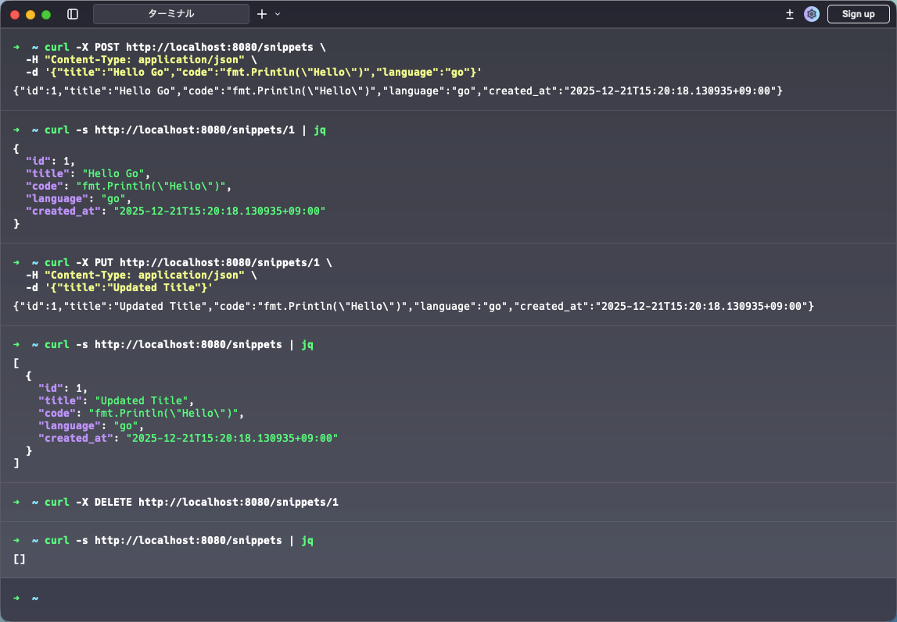

# Go 標準ライブラリで REST API を作る

このプロジェクトは、Go 言語の標準ライブラリだけで REST API を構築するサンプルコードです。

## 動作画面



## 記事

[Go 標準ライブラリだけで REST API を作る - JSON 処理から API テストまで](https://techarm.dev/posts/go-api-standard-library)

## 必要条件

- Go 1.22 以上（パターンルーティング機能を使用）

## 実行方法

```bash
cd snippetapi
go run main.go
```

ブラウザまたは curl で http://localhost:8080 にアクセスしてください。

## API エンドポイント

| メソッド | パス             | 説明               |
| -------- | ---------------- | ------------------ |
| GET      | `/health`        | ヘルスチェック     |
| GET      | `/snippets`      | スニペット一覧取得 |
| GET      | `/snippets/{id}` | スニペット詳細取得 |
| POST     | `/snippets`      | スニペット作成     |
| PUT      | `/snippets/{id}` | スニペット更新     |
| DELETE   | `/snippets/{id}` | スニペット削除     |

## 動作確認

```bash
# ヘルスチェック
curl http://localhost:8080/health

# スニペット作成
curl -X POST http://localhost:8080/snippets \
  -H "Content-Type: application/json" \
  -d '{"title":"Hello World","code":"fmt.Println(\"Hello\")","language":"go"}'

# スニペット一覧取得
curl http://localhost:8080/snippets

# スニペット詳細取得
curl http://localhost:8080/snippets/1

# スニペット更新
curl -X PUT http://localhost:8080/snippets/1 \
  -H "Content-Type: application/json" \
  -d '{"title":"Updated Title"}'

# スニペット削除
curl -X DELETE http://localhost:8080/snippets/1
```

## テスト実行

```bash
cd snippetapi
go test -v
```

## ファイル構成

```
snippetapi/
├── go.mod
├── main.go
└── main_test.go
```

## 学べること

- `encoding/json` による JSON 処理（Marshal/Unmarshal）
- 構造体タグによる JSON フィールド名の指定
- RESTful なエンドポイント設計
- CRUD エンドポイントの実装
- `net/http/httptest` を使った API テスト
- ヘルパー関数によるレスポンス処理の共通化

## ライセンス

MIT
