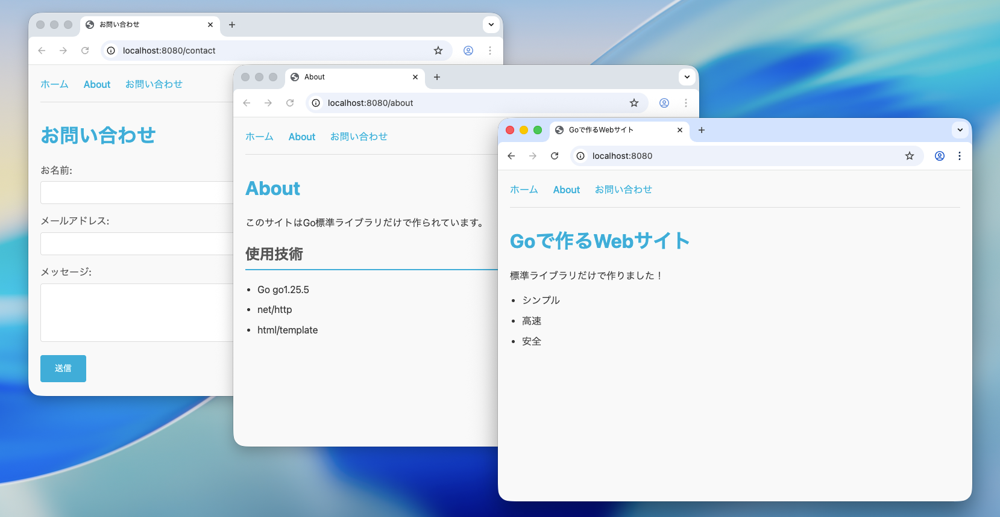

# Go 標準ライブラリで Web サーバーを作る

このプロジェクトは、Go 言語の標準ライブラリ`net/http`だけで Web サーバーを構築するサンプルコードです。

## 動作画面



## 記事

[Go 標準ライブラリだけで Web サーバーを作る - net/http の基本から実践まで](https://techarm.dev/posts/go-web-standard-library)

## 必要条件

- Go 1.22 以上（パターンルーティング機能を使用）

## 実行方法

```bash
cd myapp
go run main.go
```

ブラウザで http://localhost:8080 にアクセスしてください。

## 機能

- `/` - ホームページ
- `/about` - About ページ（Go バージョン表示）
- `/users/{id}` - ユーザー詳細（パスパラメータの例）
- `/contact` - お問い合わせフォーム
- `/static/*` - 静的ファイル配信

## ファイル構成

```
myapp/
├── go.mod
├── main.go
├── static/
│   ├── css/
│   │   └── style.css
│   └── js/
│       └── main.js
└── templates/
    ├── layout.html
    ├── home.html
    ├── about.html
    └── contact.html
```

## 学べること

- 最小限の Web サーバーの作り方
- Go 1.22 のパターンルーティング（`GET /users/{id}`形式）
- HTML テンプレート（`html/template`パッケージ）
- 静的ファイルの配信（`http.FileServer`）
- フォーム処理（`r.ParseForm()`, `r.FormValue()`）
- サーバー設定の最適化（タイムアウト設定）

## ライセンス

MIT
